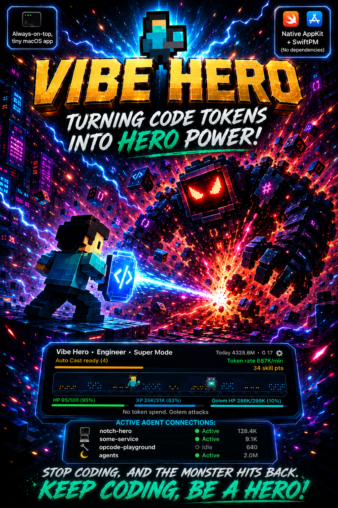
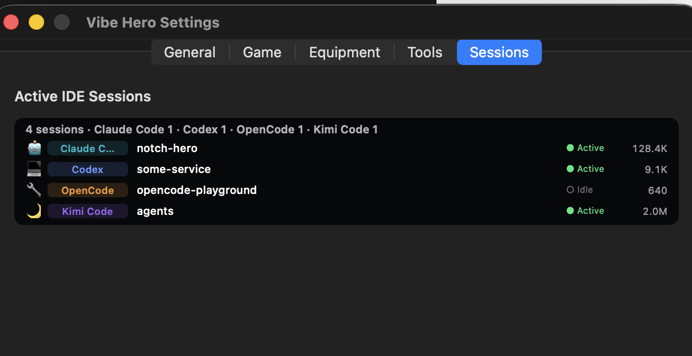
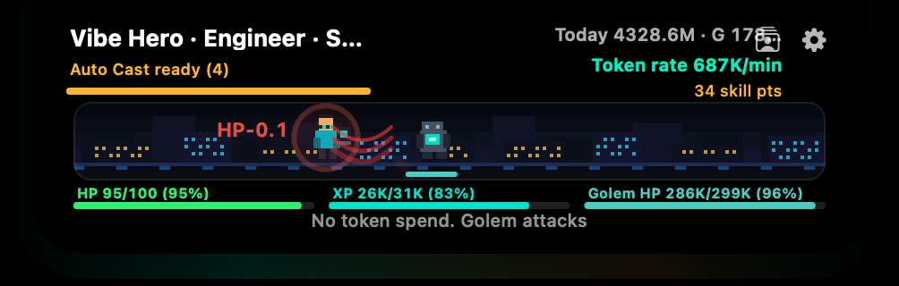
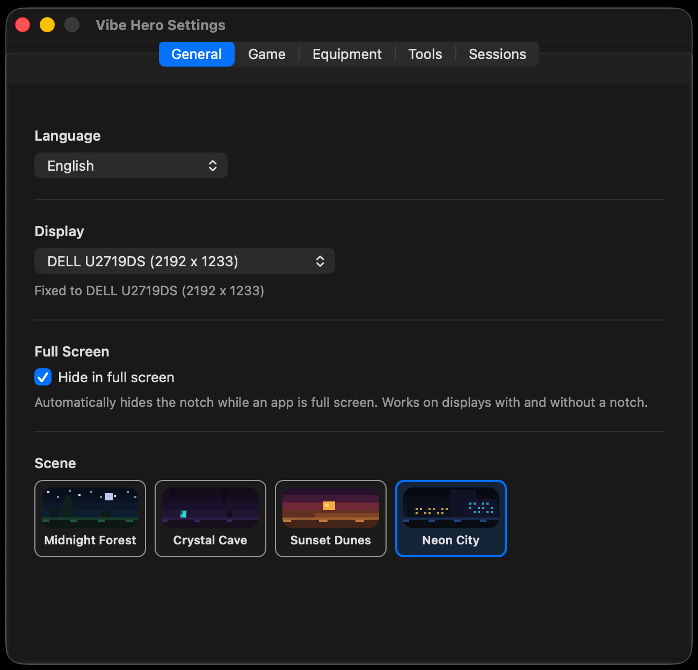
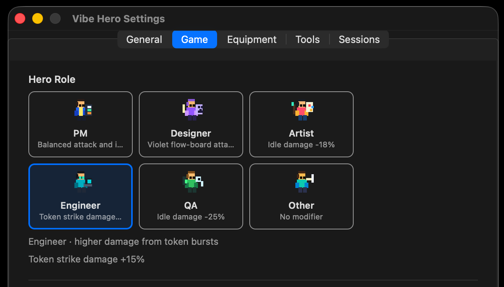
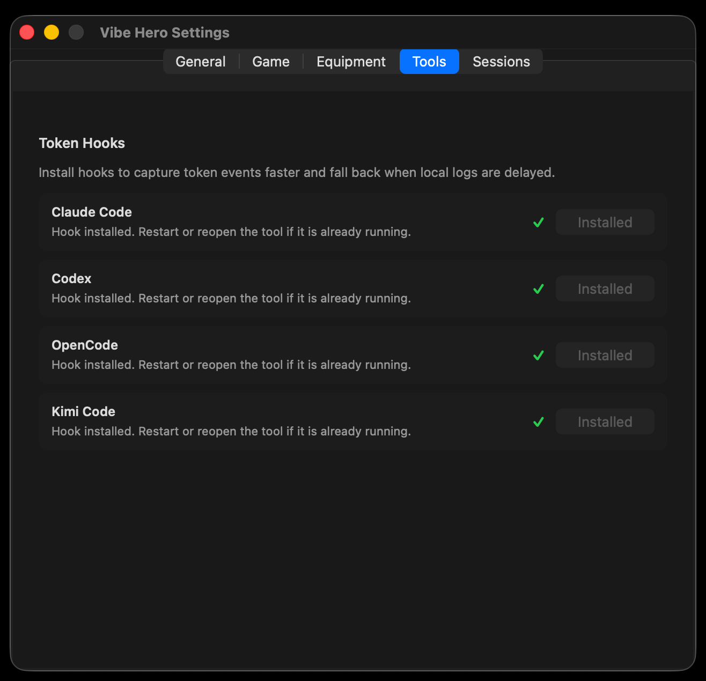

# Vibe Hero

<p align="center">
  
</p>

Your MacBook notch is a pixel-art RPG, and your token usage is the sword.

Vibe Hero is a tiny native macOS app (AppKit + SwiftPM, no third-party dependencies) that
parks a transparent, always-on-top panel in the notch. It reads the token counters your
local coding agents already write to disk — Claude Code, Codex, OpenCode, Kimi Code — and
turns every token you spend into a hero attack. Stop coding and the monster starts hitting
back.

- macOS 14.0+ · Swift 6 (strict concurrency) · pure AppKit · zero dependencies
- Reads **only** local JSONL logs — timestamps and token counters, nothing else
- Accessory app: no Dock icon, lives in the notch and the menu bar

## Install

**Homebrew** — builds from source on your machine, so macOS never shows a Gatekeeper
prompt:

```sh
brew install tsonglew/tap/vibe-hero
cp -R "$(brew --prefix vibe-hero)/Vibe Hero.app" /Applications
open "/Applications/Vibe Hero.app"
```

Upgrades ride along with `brew upgrade`. First install takes a minute or two — it compiles
the package locally.

**Manual download** — grab `Vibe-Hero-v0.1.0.zip` from
[Releases](https://github.com/tsonglew/VibeHero/releases), unzip, and drag the app to
`/Applications`. The build is unsigned, and macOS quarantines anything downloaded in a
browser, so the first double-click is blocked. Remove the quarantine mark once:

```sh
xattr -dr com.apple.quarantine "/Applications/Vibe Hero.app"
```

(or System Settings → Privacy & Security → **Open Anyway** after the first attempt.)

Both paths are local-only: the app reads token counters from local agent logs and talks to
nothing on the network.

---

## 1. The game

### The loop

```
local JSONL logs ──► TokenUsageScanner ──► token delta ──► hero strike (damage == tokens)
       │
       └── no new tokens for ~6s ──► monster counterattacks every 2s until you type again
```

1. **Scan.** Every 5 seconds `TokenUsageScanner` re-reads today's token counters from local
   agent logs. The first pass reads the files; after that it tails only newly appended
   lines, so idle CPU stays near zero.
2. **Strike.** Each new batch of tokens becomes a hero attack. Damage is the token delta
   scaled by role, learned skills, combo, equipped gear, and any active Power Boost. The
   monster's HP is shown in token units, so the damage number you see *is* the tokens you
   just spent. Every strike takes at least 2% of the bar, so even a tiny burst reads.
3. **Idle risk.** With no token activity in the last 6 seconds, the monster counterattacks
   every 2 seconds for ~0.11 HP a hit (hero max HP is 100 — roughly half an hour of pure
   idling to fall). Getting hit breaks your combo. At 0 HP the hero becomes a soul, attacks
   and skills pause, and the next token you spend revives it at 28% HP.
4. **Reward.** A defeated monster grants XP (level-ups → skill points), rolls loot, and the
   journey resumes toward the next monster.

If today has no real usage data anywhere, the HUD shows `NO DATA` — nothing is simulated.

### Two HUD states, plus a session list

- **Collapsed** — a slim pill: hero level, today's tokens, HP, XP bar. It jabs and pulses on
  each strike, so attacks read without expanding.
- **Expanded** (hover) — the battle scene: hero vs. monster, floating damage, monster HP,
  token rate, skill energy, combat status, stage title. Auto-collapses shortly after the
  pointer leaves.
- **Session list** — the button next to the gear flips the expanded panel into a live list of
  your open agent projects, each row tagged with the agent that owns it (`Claude Code`,
  `Codex`, `OpenCode`, `Kimi Code`), its last activity, and its token count. The live set
  comes from the process table (an agent CLI's working directory *is* an open project), not
  from stale transcript directories.

<p align="center">
  
  <br>
  <em>The same list, shown in <strong>Settings → Sessions</strong>: one row per open agent project,<br>badged by agent, with live/idle state and today's tokens.</em>
</p>

### The journey: stages, batches, bosses

- Monsters stand at fixed spots in the world. The ground scrolls at 54 pt/s under a
  three-layer parallax backdrop, carrying the next monster in from the right; the world
  pauses when it reaches melee range and resumes when it falls.
- Monsters arrive in **batches of 5–8** (boss stages: a single boss), spaced 120–180 world
  units apart. Killing one advances to the next in the batch after 0.85 s.
- Every **8 kills** advances the stage. **Every 5th stage is a boss stage**: crowned, larger,
  ×2.2 HP, double XP, a guaranteed Rare-or-better equipment drop, and 20–40 bonus gold.
- Monster HP scales as `base × 100 × (1 + 0.10 × (stage − 1)) × (boss ? 2.2 : 1)`, so a
  Stage-1 Prompt Wraith shows ~12K and a Stage-5 boss ~44K.

### Combat feel

- **Sword arcs and lunges.** Each hero strike sweeps a glowing arc through the monster while
  the hero lunges and tilts into it; the monster answers with a claw rake that lands *on*
  the hero.
- **Damage beside the victim.** Lost HP pops out next to whoever got hit — on the monster's
  outer side, mirrored to the hero's left — so it always reads as "that actor lost that much".
- **Bursts and tiers.** A token burst splits into 1/2/3/5 staggered strikes by size
  (<60 / 60–250 / 250–900 / 900+ tokens), and the tier scales projectiles, arcs, flashes, and
  shake weight.
- **Combo** ×10 max: ticks within 12 s of each other stack, each point adding +5% damage.
  **Crits** land 12% of the time for double damage.
- HP bars keep a ghost trail behind the real bar, and pulse below 30% hero HP. Monsters flash,
  shake, and spray sparks; level-ups fire a golden burst; bosses arrive heavy.
- Everything is rate-limited and pooled — effects only render while the HUD is expanded.

<p align="center">
  
  <br>
  <em>Idle risk, mid-counterattack — the claw rake and hit ring land on the hero, <code>HP-0.1</code> pops out<br>to its left, hero HP falls to 95, and the status line reads "No token spend. Golem attacks".</em>
</p>

### Roles, monsters, loot, levels

Six roles (PM / Designer / Artist / Engineer / QA / Other) trade token-strike damage against
idle defense — Engineer hits hardest (+15%), QA takes the least idle damage (−25%). Four
monsters rotate (Prompt Wraith, Cache Golem, Token Slime, Null Sentinel). Kills roll potions,
Power Boosts, gold, and rarity-tiered Weapon/Armor/Charm drops that auto-equip or salvage into
gold. Hero level comes from kill XP only — never directly from tokens.

The exact numbers live in code: role perks in `HeroRole` (`NotchContentView.swift`), monster
HP/XP in `MonsterKind` (`GameViews.swift`), loot and rarity odds in `ItemSystem.swift`, and the
level curve in `ExperienceCurve` (`NotchContentView.swift`).

### Backdrops

Pick one in **Settings → General → Scene**: Midnight Forest, Crystal Cave, Sunset Dunes, or
Neon City. Each draws a starfield/skyline/dune sky plus three endlessly scrolling parallax
layers (far silhouettes, near silhouettes, ground marks).

### Settings

Five tabs, all persisted in `UserDefaults` under `NotchHero.*` keys:

| Tab | Contents |
|-----|----------|
| **General** | Language, display pinning, hide-in-full-screen, battle backdrop |
| **Game** | Hero role; skill tree *(behind an "In development" scrim)* |
| **Equipment** | Equipped Weapon / Armor / Charm *(behind an "In development" scrim)* |
| **Tools** | Token Hooks installers |
| **Sessions** | The same live agent-session list as the HUD |

`Hide in full screen` (off by default) hides the notch while an app covers the whole pinned
screen; push the pointer against the top edge to peek it back out, like the menu bar.

<p align="center">
  
  <br>
  <em><strong>General</strong> — language, which display to pin to, hide-in-full-screen,<br>and the Scene picker with a live thumbnail of each backdrop.</em>
</p>

<p align="center">
  
  <br>
  <em><strong>Game</strong> — the six hero roles, each with its own pixel portrait and perk.<br>The skill tree lives below this, behind the "In development" scrim.</em>
</p>

### Token sources & privacy

Nothing leaves your machine. The scanner extracts timestamps and token counters only — no
prompts, no completions.

| Source | Path |
|--------|------|
| Claude Code | `~/.claude/projects/**/*.jsonl` |
| Codex | `~/.codex/sessions/YYYY/MM/DD/*.jsonl` |
| Codex (archived) | `~/.codex/archived_sessions/**/*.jsonl` |
| Hook fallback | `~/.vibe-hero/token-events.jsonl` |

Local logs can lag a few seconds. **Settings → Tools** installs faster event hooks that write
to the fallback log:

| Agent | Install target |
|-------|----------------|
| Claude Code | hooks appended to `~/.claude/settings.json` |
| Codex | hooks appended to `~/.codex/hooks.json`, `codex_hooks` enabled |
| OpenCode | plugin under `~/.config/opencode/plugins` |
| Kimi Code | MCP server at `~/.vibe-hero/mcp/kimi-token-server.js`, registered in `~/.kimi-code/config.toml` |

JSONL logs stay the primary source where they exist; hook events fill gaps without
double-counting. OpenCode and Kimi Code are hook/MCP-only today.

<p align="center">
  
  <br>
  <em><strong>Tools</strong> — one-click hook installers per agent. Installing rewrites that agent's<br>own config, so restart or reopen the tool afterwards.</em>
</p>

### Localization

English, 简体中文, 日本語 — switched in **Settings → General → Language**. English is the
fallback.

---

## 2. Development guide

### Requirements

macOS 14.0+, a Swift 6 toolchain (full Xcode by default), and nothing else — no CocoaPods, no
SPM dependencies, no code generation.

### Commands

```sh
make run      # swift run NotchHero
make dev      # run + auto-restart on any change under Package.swift / Sources
make build    # debug build   → .build/arm64-apple-macosx/debug/NotchHero
make release  # release build → .build/release/NotchHero
make app      # app bundle    → ".build/app/Vibe Hero.app"
make install  # copy the bundle to /Applications
make clean    # swift package clean
```

`make dev` (`scripts/dev-run.sh`) polls source mtimes every second and restarts the process on
change — an auto-restart loop, not Swift hot reload. To point Swift at another toolchain:

```sh
make run DEVELOPER_DIR=/path/to/Xcode.app/Contents/Developer
```

The app is `LSUIElement`, so it never appears in the Dock. Use the menu bar icon to re-show
the notch or quit. `pkill -f 'Vibe Hero'` kills a bundled instance; `pkill -f NotchHero` kills
a `swift run` one.

### Source layout

| File | Responsibility |
|------|----------------|
| `main.swift` | AppKit entry point |
| `AppDelegate.swift` | Accessory lifecycle, menu bar item, screen/language observers |
| `NotchWindow.swift` | Transparent borderless always-on-top panel anchored to the notch |
| `FullScreenMonitor.swift` | Detects apps covering the pinned screen; drives hide-in-full-screen |
| `NotchContentView.swift` | Collapsed + expanded HUD, combat loop, stages, combo, crits, XP, roles |
| `GameViews.swift` | Pixel actors, battle scene, backdrops, effects, floating text, HP bars |
| `SkillSystem.swift` | Legacy skill ranks/energy/cooldowns — **this is what combat reads** |
| `SkillTreeSystem.swift` | New node-graph skill tree model *(UI-only so far)* |
| `SkillTreeView.swift` | New skill-tree canvas + detail panel *(behind the scrim)* |
| `ItemSystem.swift` | Loot table, equipment slots/rarities, gold, Power Boost |
| `TokenUsage.swift` | Incrementally tails local JSONL logs into a token snapshot |
| `TokenHookInstaller.swift` | Installs/removes hooks for Claude / Codex / OpenCode / Kimi |
| `SessionMonitor.swift` | Live agent sessions from the process table + hook logs; `SessionListView` |
| `NotchSettingsWindow.swift` | The five settings tabs |
| `Localization.swift` | i18n layer (~250 keys × 3 languages) |

### Conventions

- **All user-facing text goes through `Localization.swift`**, with entries added for all three
  languages. English is the fallback. This is a hard project rule (see `AGENTS.md`) and it
  covers menu items, settings labels, HUD status text, combat text, monster and role names,
  and empty/error states.
- Swift 6 strict concurrency: UI types are `@MainActor`; anything crossing a thread boundary
  is `Sendable`. Background scans hop to a utility queue and come back to `main`.
- 4-space indent, K&R braces, `private` by default, no force-unwraps in view code.
  There is **no** SwiftLint/SwiftFormat config — don't run `swift-format` with its defaults,
  it will reformat the tree to 2-space indent.
- Persisted state uses `UserDefaults` keys prefixed `NotchHero.` (`totalKills`, `heroTotalXP`,
  `equipment.*`, `skill.*`, `skillTree.node.*`, `backdrop`, `language`, `pinnedDisplayID`,
  `hideInFullScreen`, `inventory.gold`, …). Deleting them resets a save.
- Comments explain *why*, especially where a fix encodes a platform quirk. Several of the
  comments in `GameViews.swift` are the only record of the bugs below.

### Rendering & animation notes

The battle scene is hand-drawn CoreGraphics plus pooled CALayers, and it has bitten us in five
specific ways. All of these are load-bearing:

1. **Never `view.layer?.addSublayer(...)` for effects.** AppKit keeps subview backing layers at
   the *end* of a layer-backed view's `sublayers`, so a raw sublayer renders *below* every
   subview — that is how the entire effect suite once became invisible behind the backdrop. Add
   effects to the `EffectOverlayView` host (`effectsLayer`), which is added last.
2. **Suppress implicit animations when repositioning pooled layers.** A bare `CALayer` animates
   its own `position`/`bounds` over ~0.25 s, so a reused hit layer glides in from the previous
   hit while its explicit animation plays elsewhere. Use `placeEffect(_:at:)` /
   `placeEffect(_:frame:)`, which wrap the move in `CATransaction.setDisableActions(true)`.
3. **Build effect paths around `.zero` and move the layer.** A path in scene coordinates on a
   zero-bounds layer scales away from the *scene origin* under `transform.scale`, landing the
   art 60–130 pt off target.
4. **Pause/resume with `timeOffset` and `beginTime`, never `speed` alone.** `speed = 0` drops
   local time to `timeOffset` (0) and snaps an animation back to its start; `speed = 1` then
   jumps to the "as if never paused" phase. For the parallax scroll that was a jump of up to a
   full period (>200 pt) on every kill, which read as the hero teleporting sideways. See
   `BackdropView.pauseScroll(_:)` / `resumeScroll(_:)`.
5. **Let effects self-clean.** Give the layer a model state that is invisible (`opacity = 0`)
   and animate opacity `[1, 1, 0]`; no `asyncAfter` cleanup, no leaked layers.

Performance rules of thumb: pool layers instead of allocating per hit, animate layer transforms
instead of redrawing sprites or resizing `NSTextField`s (that re-renders text every frame), and
gate everything on `rendersCombatEffects`, which is only true while the HUD is expanded.

### Verifying visual changes

Animations are hard to review from a running app. The workflow that works:

- Log real animation math instead of eyeballing it: read
  `layer.presentation()?.value(forKeyPath: "transform.translation.x")` at known times and
  compare against the expected rate. This is how the scroll pause/resume fix was proven.
- For a still of a mid-animation frame, drop a temporary probe window at a fixed AppKit origin
  with `window.level = .screenSaver` (otherwise it loses front position), freeze with
  `layer.speed = 0` + `layer.timeOffset = <t>` + `CATransaction.flush()`, then
  `screencapture -x -R<x>,<y>,<w>,<h> out.png` and read the image.
- Delete the probe when done; it is a harness, not a feature.

### Where to add things

| Change | Touch |
|--------|-------|
| New monster | `MonsterKind` in `GameViews.swift` (stats + pixel form) and its name keys in `Localization.swift` |
| New backdrop | `BattleBackdrop` in `GameViews.swift`: a `draw…()` painter plus a `scrollSpecs(for:)` entry |
| New role | `HeroRole` in `NotchContentView.swift` + strings |
| New token source | a reader in `TokenUsage.swift`, an installer case in `TokenHookInstaller.swift`, and an `IDEType` case in `SessionMonitor.swift` |
| New setting | the matching tab in `NotchSettingsWindow.swift`, a `NotchHero.*` default, and strings |

---

## 3. Status & roadmap

### What is playable today

Token-driven combat, the walking world, stages and bosses, combo/crit, XP and levels, loot,
gold, auto-equipping gear, the four backdrops, roles, the live session list, token hooks for
four agents, hide-in-full-screen, and three languages.

### Known gaps

- **Skills are not playable.** Two systems coexist: `SkillSystem.swift` (legacy ranks) still
  feeds combat damage and auto-cast, but nothing in the shipped UI can rank it up
  (`SkillProgress.upgrade` has no caller). The new `SkillTreeSystem` node graph has a full UI
  that is scrimmed and, so far, no effect on combat. Hence the "In development" badge.
- **Equipment management is scrimmed.** Drops, auto-equip, and salvage all run; the panel that
  shows them is disabled, and there is no manual equip/unequip or inventory.
- **Monster pacing is off.** `spawnMonsterBatch` builds monster `worldX` without the growing
  `worldOffset` baseline, so after the first batch every monster spawns already at the fight
  position instead of walking in. One-line fix, but it changes pacing, so it is being decided
  deliberately.
- **No tests, no CI, no lint config.** Nothing checks that the three localization dictionaries
  agree on keys, which is the most likely place for a silent regression.
- **Unsigned, no app icon.** `make app` writes a minimal `Info.plist` with no
  `CFBundleIconFile` and no signing identity.

### Roadmap

**Next**

- Wire `SkillTreeProgress` into the combat math (damage, crit, HP, gold, XP, cooldowns),
  migrate legacy ranks into it, and drop the skills scrim.
- Finish the equipment panel: manual equip/unequip, a small inventory, salvage confirmation —
  then drop that scrim too.
- Decide and land the `worldOffset` spawn baseline so the hero visibly walks between monsters.
- A key-coverage check over `Localization.swift` (every key present in en/zh/ja) as the first
  test, wired to a `make test` target.

**Then**

- Native log readers for OpenCode and Kimi Code, so they stop depending on hooks.
- Per-agent attribution in combat: which agent's tokens landed the hit, using the data the
  session list already collects.
- Session list interaction — click a row to focus that project or agent window.
- An app icon, signing/notarization, and a downloadable release build.
- More scenes and monsters, boss mechanics beyond a stat multiplier, and a persistent run
  summary (daily tokens → damage → levels).

**Maybe**

- A menu bar mini mode for displays without a notch.
- Optional sound, off by default.
- Import/export of a save.

---

Project rules for contributors: [`AGENTS.md`](AGENTS.md)
