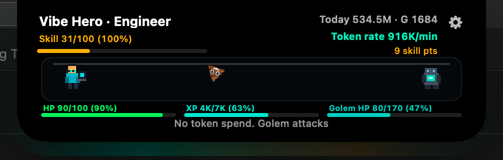
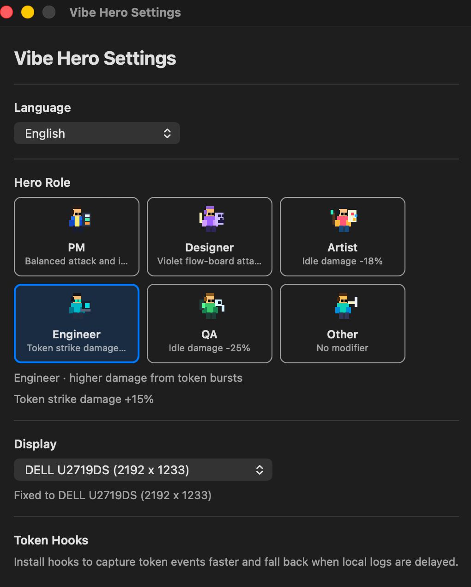

# Vibe Hero

A tiny native macOS notch app prototype. It creates a transparent, always-on-top AppKit panel anchored to the top center of the active display, plus a small menu bar item for showing or quitting the app.

## Screenshots

### Expanded Notch HUD

<p align="center">
  
</p>

### Collapsed Notch HUD

<p align="center">
  
</p>

### Settings Window

<p align="center">
  
</p>

> Full documentation — gameplay, roles, monsters, skills, loot, token sources, and
> architecture — lives in [`docs/README.md`](docs/README.md).

## Run

```sh
make run
```

For development, use auto-restart mode:

```sh
make dev
```

`make dev` watches `Package.swift` and `Sources/`, then restarts the app after code changes. This is an automatic restart workflow, not true Swift hot reload.

The app runs as an accessory app, so it does not appear in the Dock. Use the sparkle icon in the menu bar to show the notch again or quit.

The Makefile points Swift at full Xcode by default. To use a different developer directory:

```sh
make run DEVELOPER_DIR=/path/to/Xcode.app/Contents/Developer
```

## Build

```sh
make build
```

For a release build:

```sh
make release
```

The release executable will be at:

```sh
.build/release/NotchHero
```

To build a macOS app bundle:

```sh
make app
```

The app bundle will be at:

```sh
.build/app/Vibe Hero.app
```

To install it into `/Applications`:

```sh
make install
```

The installed app will be:

```sh
/Applications/Vibe Hero.app
```

## What exists now

- Native AppKit app entry point
- Transparent, borderless top-center notch panel with proportions matched to the current screen's top bar
- Collapsed view with hero level, current token total, HP, and XP progress
- Expanded battle view with hero, monster, floating combat text, monster HP bar, token rate, and combat status
- Stage progression with crowned boss stages every 5th stage, plus combo and critical-hit systems
- Token bursts split into staggered strikes with token-scaled damage numbers, plus attack-intensity tiers that scale effects with your token rate
- Rarity-tiered equipment drops (Weapon / Armor / Charm) with auto-equip, gold salvage, and a Settings equipment section
- Ghost-trail HP bars, low-HP pulse warning, level-up bursts, and boss spawn effects
- Selectable battle backdrops (Midnight Forest, Crystal Cave, Sunset Dunes, Neon City) with endless parallax scrolling as the hero walks forward
- Role, language, display, scene, equipment, and skill settings from the expanded HUD gear button, persisted with `UserDefaults`
- Hover to expand into battle, then auto-collapse shortly after the pointer leaves
- Reads real local token usage from Claude Code and Codex JSONL logs when available
- Monster counterattacks when no new token usage is detected for too long
- Rotating monster roster with distinct pixel forms plus death and respawn effects
- Always-on-top behavior across Spaces and full-screen apps
- Menu bar controls for show and quit
- Animated pixel-style game HUD driven by local token usage events

## Token Usage

Vibe Hero scans local JSONL logs every few seconds and only extracts timestamps plus token counters. After the first full read it tails only newly appended lines, so idle CPU usage stays near zero.

Current sources:

- Claude Code: `~/.claude/projects/**/*.jsonl`
- Codex: `~/.codex/sessions/YYYY/MM/DD/*.jsonl`
- Hook fallback log: `~/.vibe-hero/token-events.jsonl`

If no token events are found for the current day, the UI shows `NO DATA` instead of simulated usage.

Open Settings and use `Token Hooks` to install faster event hooks for:

- `Claude Code`: appends hooks to `~/.claude/settings.json`
- `Codex`: appends hooks to `~/.codex/hooks.json` and enables `codex_hooks`
- `OpenCode`: installs a plugin under `~/.config/opencode/plugins`

Claude Code and Codex JSONL logs remain the primary source when available; hook events are used as a fallback to avoid duplicate token counts. OpenCode token events come from the installed plugin.

Token usage only damages monsters and charges skill energy. Combat currently treats 60 seconds without new token usage as idle. After that, the monster can counterattack every 20 seconds until new token usage appears. Hero HP can fall to 0; in the Defeated state, attacks and skills pause, the hero appears as a soul, the collapsed notch shows the monster, and the next token spend revives the hero with partial HP.

Level progress comes from monster defeats:

- Each monster grants XP when defeated.
- Token usage does not directly grant XP.
- Later levels require gradually more defeat XP.

## Hero Roles

Open the expanded HUD and use the gear button in the top-right corner to open Settings and choose a role:

- `PM`: balanced attack and idle defense
- `Designer`: violet flow-board attack style
- `Artist`: reduced idle damage
- `Engineer`: stronger token strike damage
- `QA`: strongest idle defense
- `Other`: balanced default

The Settings window also includes a display pinning control:

- `Follow Active Display`: follow the active display
- Display names such as `Built-in Retina Display`: keep the notch window fixed to that display

## Localization

Open Settings and use `Language` to switch the app UI:

- `English`
- `简体中文`
- `日本語`

Menu items, Settings labels, HUD status text, combat text, monster names, role details, and skill descriptions are routed through `Sources/NotchHero/Localization.swift`.

## Skills

Each hero level grants one skill point. Open Settings to unlock or upgrade the skill tree:

- `Pulse Blade`: unlocks at LV 1 and strengthens basic strikes
- `Token Volley`: unlocks at LV 2 and adds extra token shards
- `Arc Burst`: unlocks at LV 3 and adds chained impact arcs
- `Wraith Mark`: unlocks at LV 3 and marks the target for stronger burst damage
- `Nova Storm`: unlocks at LV 5 and adds storm rings and burst waves
- `Overclock Core`: unlocks at LV 7 and speeds up sustained attacks

Higher skill ranks increase attack damage, projectile count, chain effects, sustained attack speed, and battle effect intensity. Each attack charges skill energy. When energy reaches 100 and cooldown is ready, Vibe Hero randomly casts one unlocked skill with `Auto Cast` enabled in Settings. Later skills require earlier skill ranks, so the tree branches into volley, arc, mark, nova, and overclock paths.

Combat animations are rate-limited to keep CPU and GPU usage low: sustained basic attacks fire at a slower fixed cadence, basic attack animation has a minimum interval, and skill casts use longer cooldowns plus a global cast interval.
